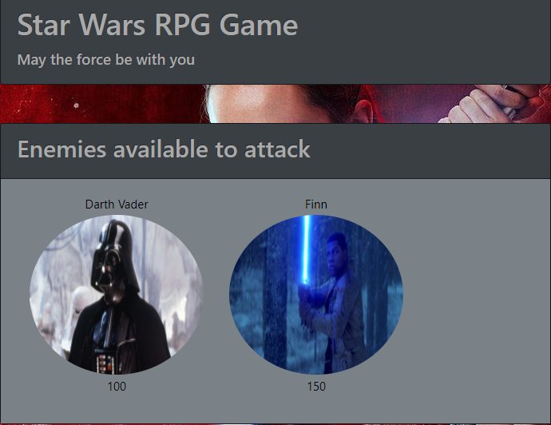

# Star-Wars-RPG-Game

## Live
<a href="https://philipstubbs13.github.io/Star-Wars-RPG-Game/index.html" target="_blank">https://philipstubbs13.github.io/Star-Wars-RPG-Game/index.html</a>

## Screenshot

## Technologies used to create game
<li>HTML5</li>
<li>CSS</li>
<li>Bootstrap 4.0.0-beta</li>
<li>Javascript</li>
<li>JQuery</li>

## How to play
<ul>
	<li>To start the game, choose a player by clicking on the image of that player in the <b>Choose your player</b> section. Choose wisely as you will play as that player for the remainder of the game.</li>
	<li>To win, you must use your player to defeat the remaining three fighters.

	<li>After you choose a player, choose an enemy to attack from the <b>Enemies available to attack</b> section.
		<info>The enemy you select is moved to the "Your opponent" section, and you are now ready to begin attacking.</info>
	<li>To attack your opponent, click <b>Attack</b>. 
	<li>When you click <b>Attack</b>, your opponent will lose a certain number of health points, which is displayed below the opponent's image.</li>
	<li>After you attack, your opponent will instantly counterattack, and you will lose some health points. Your remaining health is displayed below your player's image.</li>
	<li>Keep clicking the <b>Attack</b> button to try to weaken and defeat your opponent.</li>
	<li>If your opponent's health is reduced to zero, you have defeated that player and can choose another enemy to attack.</li>
	<li>You win by defeating all of the enemies.</li>
	<li>However, if your player's health is reduced to zero before you defeat all the enemies, you lose, and the game is over.</li>
</ul>
